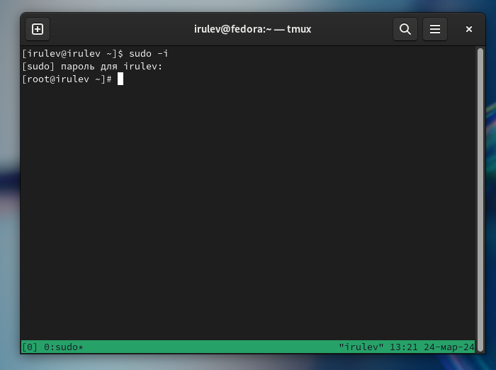
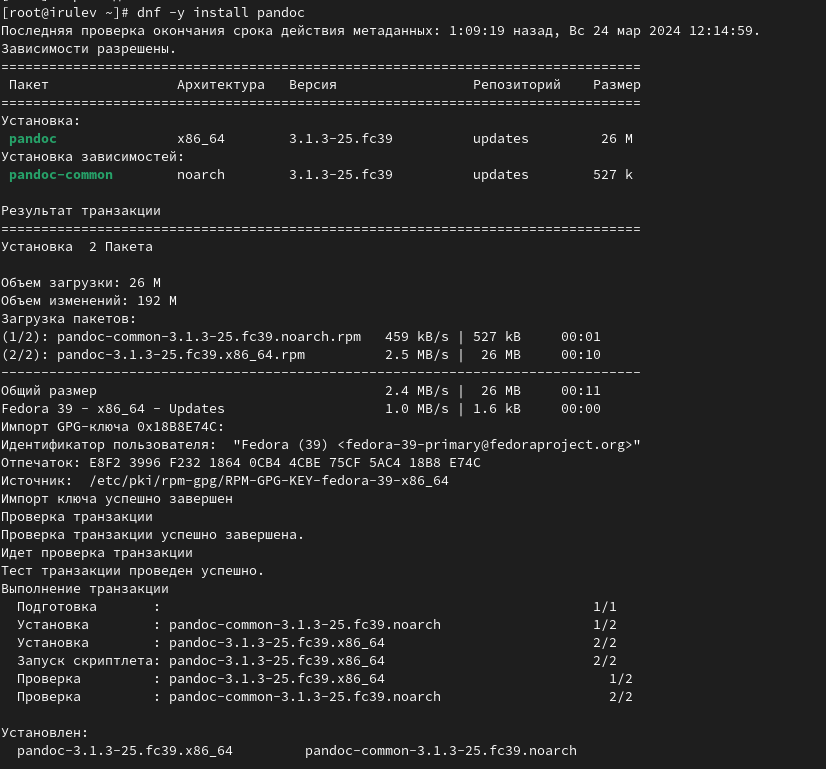
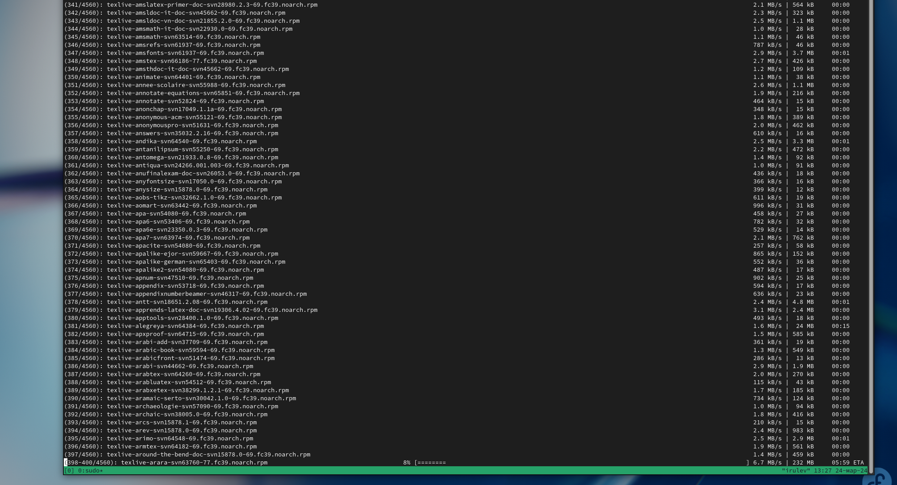
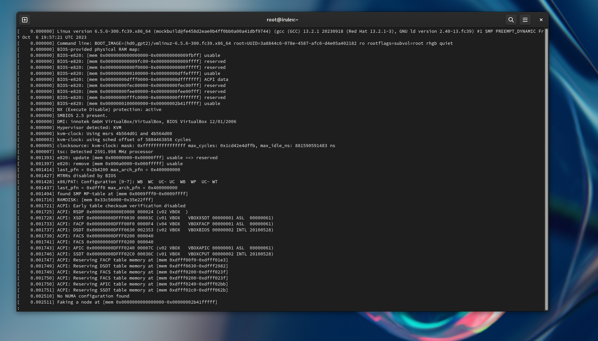

---
## Front matter
title: "Лабораторная работа №1  Установка и настройка ОС"
subtitle: "Дисциплина Операционные системы"
author: "Рулев Иван Николаевич НПМбв-02-20"

## Generic otions
lang: ru-RU
toc-title: "Содержание"

## Bibliography
bibliography: bib/cite.bib
csl: pandoc/csl/gost-r-7-0-5-2008-numeric.csl

## Pdf output format
toc: true # Table of contents
toc-depth: 2
lof: true # List of figures
lot: true # List of tables
fontsize: 12pt
linestretch: 1.5
papersize: a4
documentclass: scrreprt
## I18n polyglossia
polyglossia-lang:
  name: russian
  options:
	- spelling=modern
	- babelshorthands=true
polyglossia-otherlangs:
  name: english
## I18n babel
babel-lang: russian
babel-otherlangs: english
## Fonts
mainfont: PT Serif
romanfont: PT Serif
sansfont: PT Sans
monofont: PT Mono
mainfontoptions: Ligatures=TeX
romanfontoptions: Ligatures=TeX
sansfontoptions: Ligatures=TeX,Scale=MatchLowercase
monofontoptions: Scale=MatchLowercase,Scale=0.9
## Biblatex
biblatex: true
biblio-style: "gost-numeric"
biblatexoptions:
  - parentracker=true
  - backend=biber
  - hyperref=auto
  - language=auto
  - autolang=other*
  - citestyle=gost-numeric
## Pandoc-crossref LaTeX customization
figureTitle: "Рис."
tableTitle: "Таблица"
listingTitle: "Листинг"
lofTitle: "Список иллюстраций"
lotTitle: "Список таблиц"
lolTitle: "Листинги"
## Misc options
indent: true
header-includes:
  - \usepackage{indentfirst}
  - \usepackage{float} # keep figures where there are in the text
  - \floatplacement{figure}{H} # keep figures where there are in the text
---

# Цель работы

- Целью данной работы является приобретение практических навыков установки операционной системы на виртуальную машину, настройки минимально необходимых для дальнейшей работы сервисов.

# Выполнение лабораторной работы

## Установка программного обеспечения для создания документации


Запускаем терминальный мультиплексор *tmux* и переключаюсь на роль супер-пользователя:

{#fig:001 width=70%}


### Работа с языком разметки Markdown

Установим pandoc.

{#fig:001 width=70%}

Установим дистрибутив TeXlive.

{#fig:001 width=70%}


# Домашнее задание

- В окне терминала проанализирую последовательность загрузки системы, выполнив команду `dmesg`.

  ```
  dmesg | less
  ```

  {#fig:001 width=70%}

  

  Получаем следующую информацию.

  - Версия ядра Linux (Linux version).
  - Частота процессора (Detected Mhz processor).
  - Модель процессора (CPU0).
  - Объём доступной оперативной памяти (Memory available).
  - Тип обнаруженного гипервизора (Hypervisor detected).

  {#fig:001 width=70%}

# Ответы на контрольные вопросы

#### Какую информацию содержит учётная запись пользователя?

- Системное имя - должно быть уникальным, содержит только латинские знаки.
- Уникальных идентификатор пользователя в системе, содержит число.
- Полное имя - ФИО пользователя.

#### Укажите команды терминала и приведите примеры: 

- для получения справки по команде = --help;
- для перемещения по файловой системе = cd;
- для просмотра содержимого каталога = ls;
- для определения объёма каталога = du + имя каталога;
- для создания / удаления каталогов = mkdir/rmdir;
- для создания / удаления файлов = touch/rm;
- для задания определённых прав на файл / каталог = chmod;
- для просмотра истории команд = history;

#### Что такое файловая система? 

- FAT32 - файловая система, в которой пространство разделено на три части: область служебных структур, указатели в виде таблиц и область хранения файлов;
- ext4 - система, которая используется в основном в ОС на Linux.  Файловая система, в последней версии максимальный размер файла - 16Гб.

#### Как посмотреть, какие файловые системы подмонтированы в ОС?

Как посмотреть, какие файловые системы подмонтированы в ОС? Для этого нужно ввести в терминал команду df - это покажет список всех файловых систем по номерам устройств, размеры и данные о памяти. Но при этом можно посмотреть в свойствах папок все эти данные вручную.

#### Как удалить зависший процесс?

Как удалить зависший процесс?

- killall - остановит все процессы, которые есть в данный момент.
- kill + id-процесса. Это поможет удалить один конкретный процесс. (Чтобы узнать id нужно написать в терминале команду ps).

# Выводы

В ходе данной работы я приобрел практические навыки установки операционной системы на виртуальную машину, настройки минимально необходимых для дальнейшей работы сервисов.
