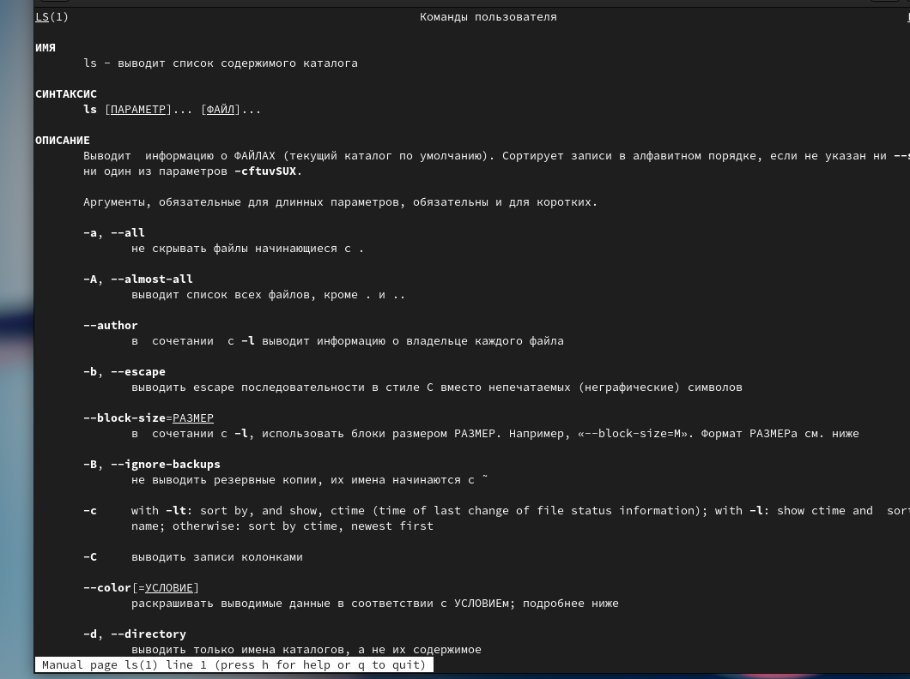

---
## Front matter
title: "Отчет по лабораторной работе №4"
subtitle: "Операционные системы"
author: "Рулев Иван"

## Generic otions
lang: ru-RU
toc-title: "Содержание"

## Bibliography
bibliography: bib/cite.bib
csl: pandoc/csl/gost-r-7-0-5-2008-numeric.csl

## Pdf output format
toc: true # Table of contents
toc-depth: 2
lof: true # List of figures
lot: true # List of tables
fontsize: 12pt
linestretch: 1.5
papersize: a4
documentclass: scrreprt
## I18n polyglossia
polyglossia-lang:
  name: russian
  options:
	- spelling=modern
	- babelshorthands=true
polyglossia-otherlangs:
  name: english
## I18n babel
babel-lang: russian
babel-otherlangs: english
## Fonts
mainfont: PT Serif
romanfont: PT Serif
sansfont: PT Sans
monofont: PT Mono
mainfontoptions: Ligatures=TeX
romanfontoptions: Ligatures=TeX
sansfontoptions: Ligatures=TeX,Scale=MatchLowercase
monofontoptions: Scale=MatchLowercase,Scale=0.9
## Biblatex
biblatex: true
biblio-style: "gost-numeric"
biblatexoptions:
  - parentracker=true
  - backend=biber
  - hyperref=auto
  - language=auto
  - autolang=other*
  - citestyle=gost-numeric
## Pandoc-crossref LaTeX customization
figureTitle: "Рис."
tableTitle: "Таблица"
listingTitle: "Листинг"
lofTitle: "Список иллюстраций"
lotTitle: "Список таблиц"
lolTitle: "Листинги"
## Misc options
indent: true
header-includes:
  - \usepackage{indentfirst}
  - \usepackage{float} # keep figures where there are in the text
  - \floatplacement{figure}{H} # keep figures where there are in the text
---

# Цель работы

Цель данной лабораторной работы -- приобретение практических навыков взаимодействия пользователя с системой посредством командной строки.

# Выполнение лабораторной работы

Полное имя домашнего каталога можно узнать с помощью утилиты pwd.

{#fig:001 width=70%}

С помощью утилиты cd перехожу в подкаталог tmp корневого каталога.

{#fig:002 width=70%}

С помощью утилиты ls, пока что без ключей, просматриваю содержимое каталога tmp.

{#fig:003 width=70%}

Пробую использовать команду ls с разными опциями. Опция -l позволит увидеть дополнительную информацию о файлах в каталоге: время создания, владельца, права.

{#fig:004 width=70%}

Опция -a покажет скрытые файлы в каталоге.

{#fig:005 width=70%}

Перехожу в каталог /var/spool/ с помощью cd.
Чтобы определить, есть ли в каталоге подкаталог с соответствующим именем воспользуемся утилитой ls с флагом -F, чтобы проверить, что мы найдем именно каталог. И да, в директории действительно есть такой каталог.

{#fig:006 width=70%}

Возвращаюсь в домашний каталог, для этого достаточно ввести команду cd. Затем проверяю содержимое каталога с помощью утилиты ls, опция -l позволяет определить владельцев файлов, опция -a показывает все содержимое каталога, -F поможет определить что из содержимого каталога файл, а что каталог.

{#fig:007 width=70%}

Создаю директорию newdir с помощью утилиты mkdir, затем проверяю, что директория создалась с помощью ls.

{#fig:008 width=70%}

Создаю для каталога newdir подкаталог morefun, проверяю, что каталог собран.

{#fig:009 width=70%}

Чтобы создать несколько директорий одной строчкой нужно перечислить названия директорий через пробел после утилиты mkdir.

{#fig:010 width=70%}

Чтобы удалить несколько **пустых** директорий одной строчкой нужно перечислить названия директорий через пробел после утилиты rmdir.

{#fig:011 width=70%}

Пытаюсь удалить newdir с помощью rm. Утилита rm по умолчанию удаляет файлы, чтобы она удалила пустую директорию нужно добавить опцию -d, но newdir не пустая директория, поэтому нужно добавить опцию для рекурсивного удаления -r. Использовалась утилиты без опций, поэтому каталог не был удален.

{#fig:012 width=70%}

Удаляю директорию newdir с помощью утилиты rmdir, т.к директория не пустая, я добавляю флаг удалить рекурсивно -p, чтобы удалилась и все подкаталоги.

{#fig:013 width=70%}

С помощью команды man ls я могу прочесть документацию к команде ls, опция, которая позволить выводить все подкаталоги каталогов предоставлена на скриншоте, это -R.

{#fig:014 width=70%}

Так как мне нужно найти опцию утилиты ls для сортировки, то логично сузить поиск до результатов с таким же вопросом. Выяснил, что для сортировки и вывода информации нужна комбинация опций -lt.

{#fig:015 width=70%}

С помощью man cd узнаю описание команды cd и ее опции. Основных опций немного.
1. -P - позволяет следовать по символическим ссылкам перед тем, как обработаны все переходы '..'
3. -L - переходит по символическим ссылкам только после того, как обработаны все переходы ".."
4. -e - позволяет выйти с ошибкой, если директория, в которую нужно перейти, не найдена.

{#fig:016 width=70%}

С помощью man pwd узнаю описание команды pwd и ее опции.
1. -L - брать директорию из переменной окружения, даже если она содержит символические ссылки.
2. -P - отбрасывать все символические ссылки.

{#fig:017 width=70%}

С помощью man mkdir узнаю описание команды mkdir и ее опции.
1. -m - устанавливает права доступа создаваемой директории как chmod, синтаксис тоже как у chmod.
2. -p - позволяет рекурсивно создавать директории и их подкаталоги
3. -v - выводи сообщение о созданных директориях
4. -z - установить контекст SELinux для создаваемой директории по умолчанию
5. -context - установить контекст SELinux для создаваемой директории в значении CTX

{#fig:018 width=70%}

С помощью man rmdir узнаю описание команды rmdir и ее опции.
1. --ignore-fail-on-non-empty - отменяет вывод ошибки, если каталог не пустой, просто его игнорирует
2. -p - удаляет рекурсивно каталоги, если они все содержат в себе только удаляемый каталог
3. -v - выводит сообщение о каждом удалении  директории.

{#fig:019 width=70%}

С помощью man rm узнаю описание команды rm и ее опции.
1. -f - игнорировать несуществующие файлы или аргументы, никогда не выводить запрос на подтверждение удаления
2. -i - выводить запрос на подтверждение удаления каждого файла
3. -I - вывести запрос на подтверждение удаления один раз, для всех файлов, если удаляется больше 3-х файлов или идет рекурсивное удаление
4. --interactive - заменяет предыдущие три опции, можно выбрать одну из них.
5. --one-file-system - во время рекурсивного удаления пропускать директории из других файловых систем
6. --no-preserve-root если в качестве директории задана корневая, то считать что это обычная директория и начать удаление.
7. -r, -R - удаляет директории их содержимое рекурсивно
8. -d, --dir - удаляет пустые директории
9. -v - прописывает все действия команды

{#fig:021 width=70%}

Опции --help --version применимы почти ко всем утилитам, они показывают справку по команде и ее версию соответственно.

Вывел историю команд с помощью утилиты history.

{#fig:022 width=70%}

# Выводы

Я приобрел практические навыки взаимодействия пользователя с системой посредством командной строки.

# Ответы на онтрольные вопросы

1. Командная строка - это текстовый интерфейс, который передает команды компьютеру и выводит результаты пользователю. В операционной системе типа Linux пользователь обычно взаимодействует с системой через командную строку, вводя команды построчно.
2. Чтобы узнать абсолютный путь к текущему каталогу, используйте команду pwd. Например: если вы находитесь в своем домашнем каталоге, выполнение команды pwd вернет /home/evdvorkina.
3. Команда ls позволяет отобразить имена файлов. Используя опцию -F, можно определить типы файлов. Чтобы увидеть скрытые файлы, добавьте опцию -a. Пример приведен в лабораторной работе.
4. Команда ls также позволяет отобразить имена файлов. Для просмотра скрытых файлов используйте опцию -a. Пример приведен в лабораторной работе.
5. Команда rmdir по умолчанию удаляет только пустые каталоги, не трогая файлы. Команда rm удаляет файлы, но не каталоги без опций (-d, -r). Чтобы удалить файл и каталог в одной строке, используйте рекурсивное удаление при необходимости. Если файлы и каталоги не связаны между собой, добавьте опцию -d и перечислите их имена после утилиты.
6. Для просмотра информации о последних выполненных командах пользователя используйте команду history. Пример приведен в лабораторной работе.
7. С помощью синтаксиса !номер_команды из вывода history можно повторить предыдущие действия и заменить часть команды с помощью операции замены s/что_заменяем/на_что_заменяем. Примеры приведены в лабораторной работе.
8. Если вы не находитесь в домашнем каталоге и вводите "cd ; ls", вы переместитесь в домашний каталог и отобразите содержимое.
9. Символ экранирования () используется перед специальными символами для их обычного использования. Это также позволяет системе читать директории с пробелами в названии. Например: cd work/Операционные\ системы/.
10. Опция -l команды ls отображает дополнительную информацию о файлах, такую как время создания, владелец и права доступа.
11. Относительный путь к файлу начинается от текущей директории и не включает её саму. Абсолютный путь начинается с корневого каталога.
12. Используйте команду man <имя_команды> или <имя_команды> --help для получения справочной информации.
13. Клавиша Tab.
