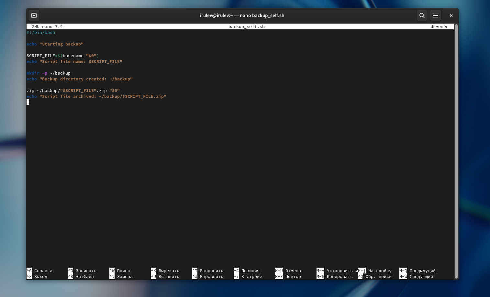
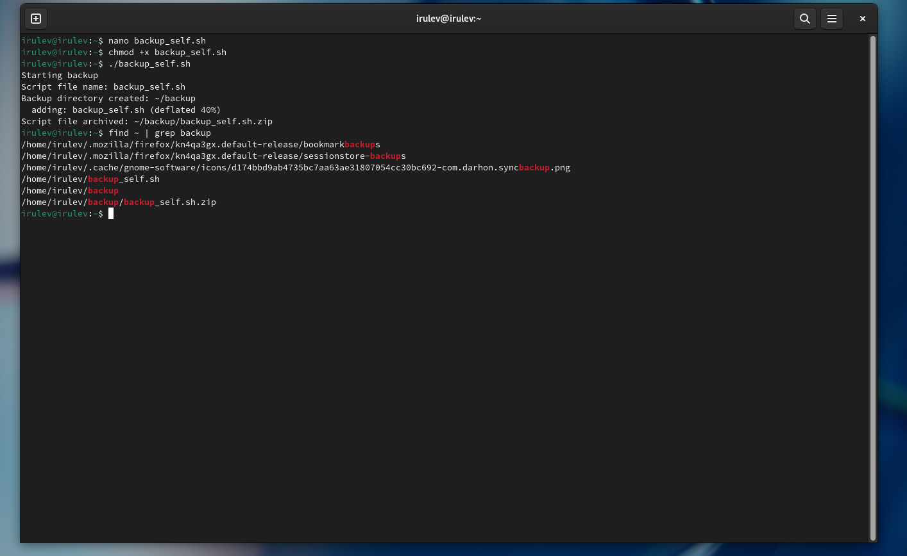
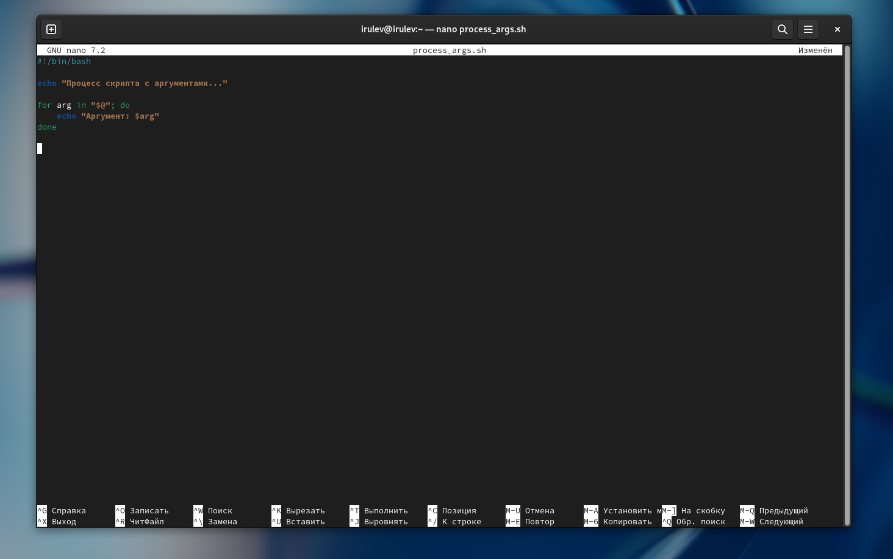
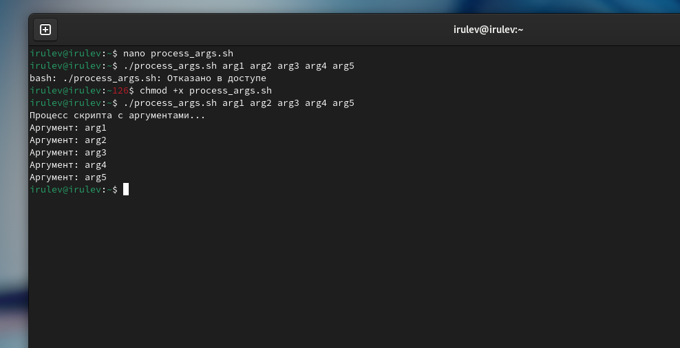
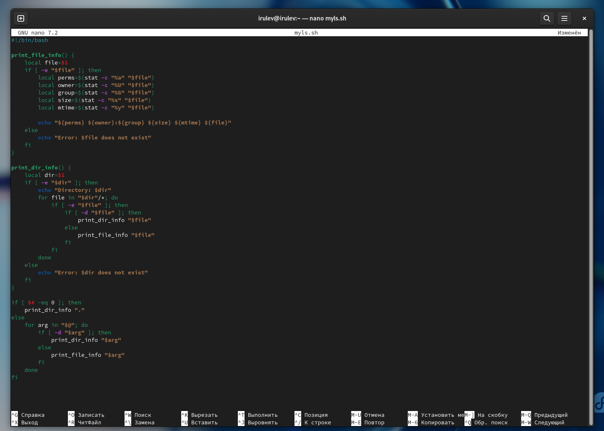
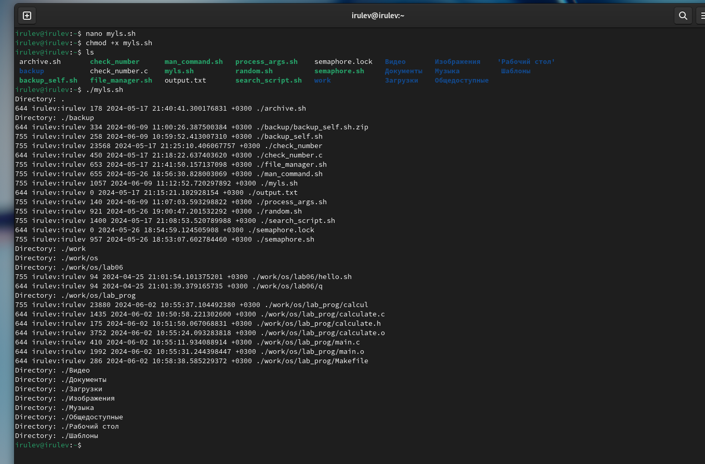
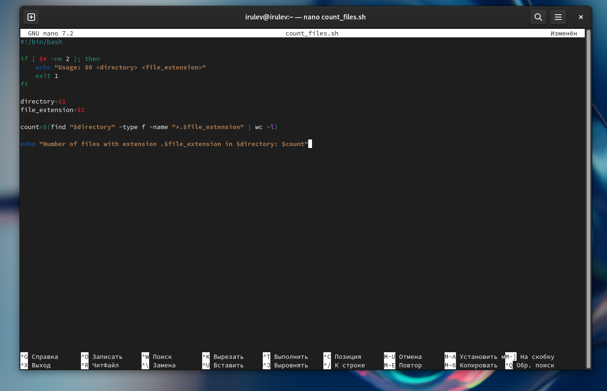
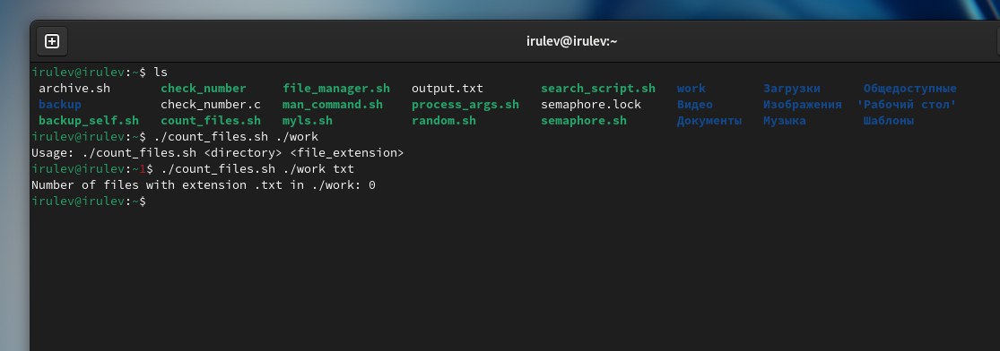

---
## Front matter
title: "Отчёт по лабораторной работе №12"
subtitle: "Программирование в командном процессоре ОС UNIX. Командные файлы"
author: "Рулев Иван"

## Generic otions
lang: ru-RU
toc-title: "Содержание"

## Bibliography
bibliography: bib/cite.bib
csl: pandoc/csl/gost-r-7-0-5-2008-numeric.csl

## Pdf output format
toc: true # Table of contents
toc-depth: 2
lof: true # List of figures
lot: true # List of tables
fontsize: 12pt
linestretch: 1.5
papersize: a4
documentclass: scrreprt
## I18n polyglossia
polyglossia-lang:
  name: russian
  options:
	- spelling=modern
	- babelshorthands=true
polyglossia-otherlangs:
  name: english
## I18n babel
babel-lang: russian
babel-otherlangs: english
## Fonts
mainfont: PT Serif
romanfont: PT Serif
sansfont: PT Sans
monofont: PT Mono
mainfontoptions: Ligatures=TeX
romanfontoptions: Ligatures=TeX
sansfontoptions: Ligatures=TeX,Scale=MatchLowercase
monofontoptions: Scale=MatchLowercase,Scale=0.9
## Biblatex
biblatex: true
biblio-style: "gost-numeric"
biblatexoptions:
  - parentracker=true
  - backend=biber
  - hyperref=auto
  - language=auto
  - autolang=other*
  - citestyle=gost-numeric
## Pandoc-crossref LaTeX customization
figureTitle: "Рис."
tableTitle: "Таблица"
listingTitle: "Листинг"
lofTitle: "Список иллюстраций"
lotTitle: "Список таблиц"
lolTitle: "Листинги"
## Misc options
indent: true
header-includes:
  - \usepackage{indentfirst}
  - \usepackage{float} # keep figures where there are in the text
  - \floatplacement{figure}{H} # keep figures where there are in the text
---

# Цель работы

Изучить основы программирования в оболочке ОС UNIX/Linux. Научиться писать небольшие командные файлы.

# Выполнение лабораторной работы

#### Напишем скрипт, который при запуске будет делать резервную копию самого себя.

{#fig:001 width=70%}

Тут происходит следующее:

1. `SCRIPT_FILE=$(basename "$0")`: эта строка получает текущее имя файла сценария с помощью команды `basename`.
2. `mkdir -p ~/backup`: эта строка создает каталог `backup` в домашнем каталоге, если он еще не существует.
3. `zip ~/backup/"$SCRIPT_FILE".zip "$0"`: эта строка архивирует файл сценария с помощью `zip`.

Запустим его.

{#fig:002 width=70%}

#### Напишем скрипт обрабатывающий любое произвольное число аргументов командной строки, в том числе превышающее десять.

{#fig:003 width=70%}

В этом примере `$@` — это специальная переменная bash, содержащая все аргументы командной строки. Цикл `for` проходит по каждому аргументу и выводит его значение с помощью `echo`.

{#fig:004 width=70%}

#### Напишем командный файл — аналог команды ls (без использования самой этой команды и команды dir). Требуется, чтобы он выдавал информацию о нужном каталоге и выводил информацию о возможностях доступа к файлам этого каталога.

{#fig:004 width=70%}

{#fig:004 width=70%}

#### Напишем командный файл, который получает в качестве аргумента командной строки формат файла (.txt, .doc, .jpg, .pdf и т.д.) и вычисляет количество таких файлов в указанной директории.

{#fig:004 width=70%}

{#fig:004 width=70%}

# Выводы

Изучили основы программирования в оболочке ОС UNIX/Linux. Научились писать небольшие командные файлы.

# Ответы на контрольные вопросы

1. **Что такое командная оболочка? Приведите примеры командных оболочек. Чем они отличаются?** Командная оболочка — это программа, которая позволяет пользователям взаимодействовать с операционной системой путем выполнения команд, сценариев и программ. Примеры командных оболочек: Bash, pdksh, tcsh и zsh. 
2. **Что такое POSIX?** POSIX (Portable Operating System Interface) — это набор стандартов для операционных систем, включая Unix и Linux, определяющий общий API для взаимодействия с операционной системой. 
3. **Как определяются переменные и массивы в Bash?** В Bash переменные определяются с помощью оператора `=`, а массивы определяются с помощью круглых скобок `()` и запятых `,` для разделения элементов.
4. **Какова цель операторов let и read?** Оператор let используется для выполнения арифметических операций, а оператор read используется для чтения ввода от пользователя или файла.
5. **Какие арифметические операции можно выполнять в Bash?** Bash поддерживает базовые арифметические операции, такие как сложение, вычитание, умножение и деление, а также более сложные операции, такие как по модулю и возведение в степень.
6. **Что означает операция (( ))?** Операция `(( ))` используется для выполнения арифметических операций и вычисления выражений в Bash.
7. **Какие стандартные имена переменных вы знаете?** Стандартные имена переменных в Bash включают, среди прочего, SHELL, PATH, HOME и USER.
8. **Что такое метасимволы?** Метасимволы — это специальные символы в Bash, имеющие определенное значение, например `*`, `?` и `[`, которые используются для сопоставления с образцом и подстановки под шаблон.
9. **Как избежать метасимволов?** Метасимволы можно экранировать с помощью обратной косой черты `\` или заключая их в кавычки.
10. **Как создавать и запускать командные файлы?** Командные файлы, также известные как сценарии, можно создавать с помощью текстового редактора и запускать с использованием нотации `./`, за которой следует имя сценария.
11. **Как определяются функции в Bash?** Функции в Bash определяются с помощью ключевого слова function, за которым следует имя функции и аргументы в круглых скобках.
12. **Как определить, является ли файл каталогом или обычным файлом?** Вы можете использовать команду `test` или оператор `[`, чтобы определить, является ли файл каталогом или обычным файлом, используя параметры `-d` и `-f` соответственно.
13. **Какова цель команд set, typeset и unset?** Команда `set` используется для установки параметров оболочки, `typeset` используется для объявления переменных, а `unset` используется для удаления переменных или функций.
14. **Как параметры передаются в командные файлы?** Параметры можно передавать в командные файлы с использованием синтаксиса `$1`, `$2` и т. д., который представляет первый, второй и т. д. аргумент командной строки.
15. **Что такое специальные переменные в Bash и каково их назначение?** К специальным переменным в Bash относятся, среди прочего, SHELL, PATH, HOME и USER, которые используются для хранения информации об оболочке и среде пользователя.
